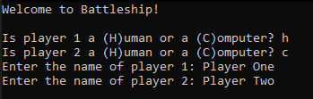
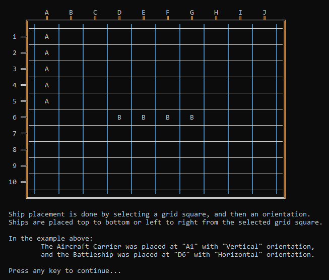
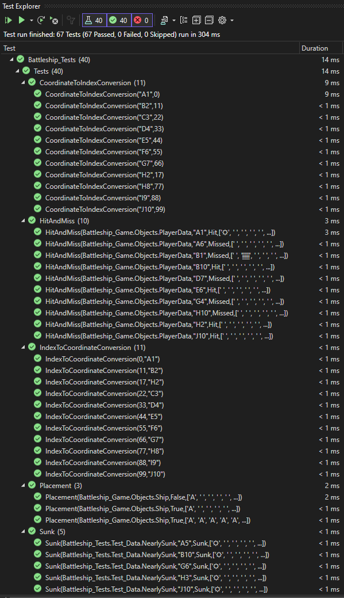
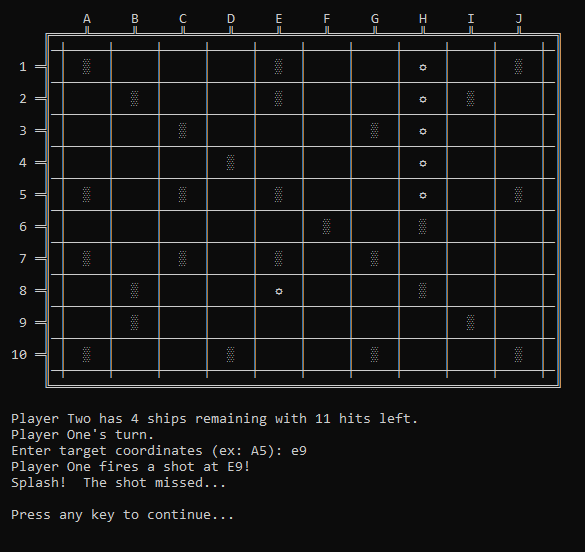
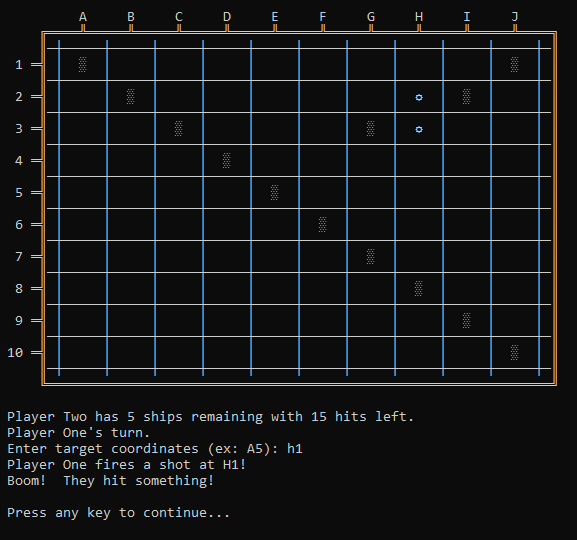
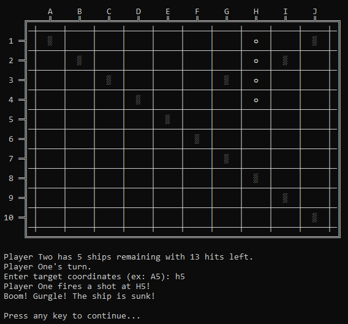

# Battleship Game

Console clone of the Battleship board game, written in C#.

Capstone Project for the [Skill Foundry](https://www.skillfoundry.io) "Object-Oriented Programming in C#" course.  

## External Packages

*All packages are avaliable via [NuGet Package Manager](https://www.nuget.org/).*

### NUnit

&nbsp;&nbsp;&nbsp;&nbsp;*NUnit is a unit-testing framework for all .Net languages.*
  * [NUnit.org](https://nunit.org/)

### NUnit 3 Test Adapter

&nbsp;&nbsp;&nbsp;&nbsp;*The NUnit3 TestAdapter for Visual Studio.*
  * [Project URL](https://docs.nunit.org/articles/vs-test-adapter/Index.html)

### Microsoft.NET.Test.Sdk

&nbsp;&nbsp;&nbsp;&nbsp;*The MSbuild targets and properties for building .NET test projects.*
  * [Github URL](https://github.com/microsoft/vstest)

## The Game

The game is 1vs1, played in the console.  Two human players may play against one another, a human player may play against a computer (computer players take shots randomly), or two computers can play against one another if desired.  Each player enters their name, then places their ships on a 10x10 grid.  Players then take turns guessing the location of the other players' ships with the goal of sinking them all.  When a player fires a shot at the selected grid location, the results of the shot are reported to the console - Hit, Miss, or Sunk.  The game ends when a player sinks all their enemy's ships.  The project includes a suite of unit tests to verify proper function.

## Image Gallery

|Player Select|Ship Placement|Unit Tests|
|:-:|:-:|:-:|
| ||
|<b>Shot Missed</b>|<b>Ship Hit</b>|<b>Ship Sunk</b>|
| || 

